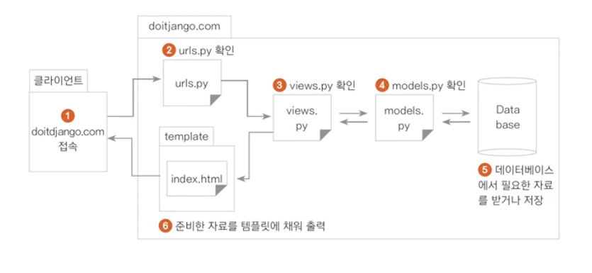

# do_it_django

## Django로 블로그 만들기

## FBV vs. CBV

### FBV(Function Based Views)

함수형 뷰

쉽고 가독성이 좋게 뷰를 구성 할 수 있다.

### CBV(Class Based Views)

클래스형 뷰

상속과 재사용성이 높은 뷰를 구성 할 때 에는 클래스형 뷰를 사용한다.

아무리 클래스형 뷰라도 마지막에 뷰를 처리하는 것은 함수
